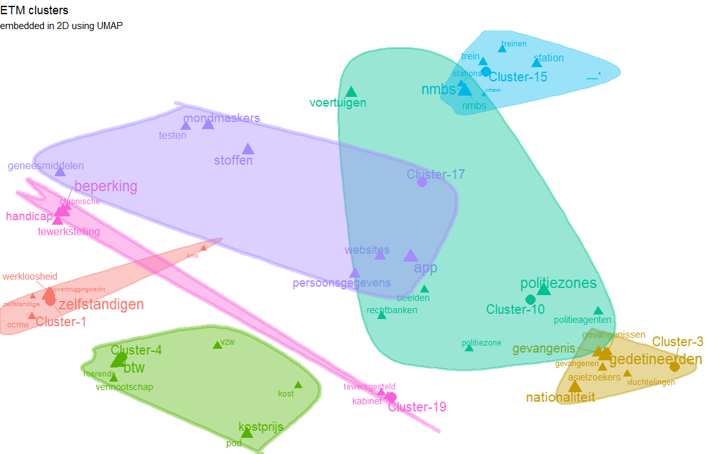
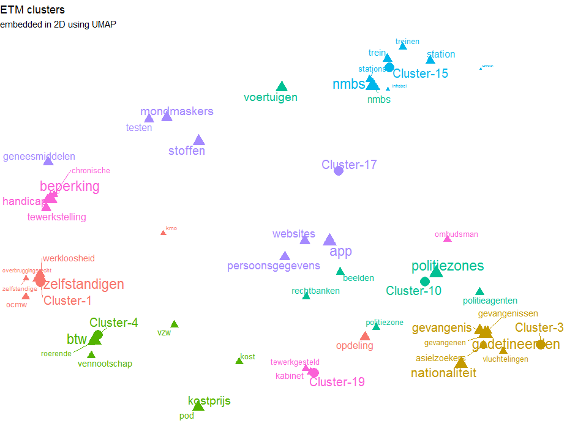

# ETM - R package for Topic Modelling in Embedding Spaces

This repository contains an R package called `topicmodels.etm` which is an implementation of ETM

- ETM is a generative topic model combining traditional topic models (LDA) with word embeddings (word2vec)
    - It models each word with a categorical distribution whose natural parameter is the inner product between a word embedding and an embedding of its assigned topic
    - The model is fitted using an amortized variational inference algorithm on top of libtorch (https://torch.mlverse.org)
- The techniques are explained in detail in the paper: "Topic Modelling in Embedding Spaces" by Adji B. Dieng, Francisco J. R. Ruiz and David M. Blei, available at https://arxiv.org/pdf/1907.04907.pdf 



### Installation

This R package is not on CRAN (yet), for now, you can install it as follows 

```
install.packages("torch")
install.packages("word2vec")
install.packages("doc2vec")
install.packages("udpipe")
install.packages("remotes")
library(torch)
remotes::install_github('bnosac/ETM', INSTALL_opts = '--no-multiarch')
```

Once the package has some plotting functionalities, I'll push it on CRAN.

### Example

Build a topic model on questions answered in Belgian parliament in 2020 in Dutch.

#### a. Get data 

- Example text of +/- 6000 questions asked in the Belgian parliament (available in R package doc2vec).
- Standardise the text a bit

```
library(torch)
library(topicmodels.etm)
library(doc2vec)
library(word2vec)
data(be_parliament_2020, package = "doc2vec")
x      <- data.frame(doc_id           = be_parliament_2020$doc_id, 
                     text             = be_parliament_2020$text_nl, 
                     stringsAsFactors = FALSE)
x$text <- txt_clean_word2vec(x$text)
```

#### b. Build a word2vec model to get word embeddings and inspect it a bit

```
set.seed(1234)
w2v        <- word2vec(x = x$text, dim = 25, type = "skip-gram", iter = 10, min_count = 5, threads = 2)
embeddings <- as.matrix(w2v)
predict(w2v, newdata = c("migranten", "belastingen"), type = "nearest", top_n = 4)
$migranten
      term1               term2 similarity rank
1 migranten              lesbos  0.9434163    1
2 migranten               chios  0.9334459    2
3 migranten vluchtelingenkampen  0.9269973    3
4 migranten                kamp  0.9175452    4

$belastingen
        term1                term2 similarity rank
1 belastingen            belasting  0.9458982    1
2 belastingen          ontvangsten  0.9091899    2
3 belastingen              geheven  0.9071115    3
4 belastingen            ontduiken  0.9029559    4
```

#### c. Build the embedding topic model

- Create a bag of words document term matrix (using the udpipe package but other R packages provide similar functionalities)
- Keep only the top 50% terms with the highest TFIDF
- Make sure document/term/matrix and the embedding matrix have the same vocabulary
    
```
library(udpipe)
dtm   <- strsplit.data.frame(x, group = "doc_id", term = "text", split = " ")
dtm   <- document_term_frequencies(dtm)
dtm   <- document_term_matrix(dtm)
dtm   <- dtm_remove_tfidf(dtm, prob = 0.50)

vocab        <- intersect(rownames(embeddings), colnames(dtm))
embeddings   <- dtm_conform(embeddings, rows = vocab)
dtm          <- dtm_conform(dtm,     columns = vocab)
dim(dtm)
dim(embeddings)
```
    
- Learn 20 topics with a 100-dimensional hyperparameter for the variational inference

```
torch_manual_seed(4321)
model     <- ETM(k = 20, dim = 100, embeddings = embeddings)
optimizer <- optim_adam(params = model$parameters, lr = 0.005, weight_decay = 0.0000012)
loss      <- model$fit(data = dtm, optimizer = optimizer, epoch = 20, batch_size = 1000)
plot(model, type = "loss")
```


#### d. Inspect the model 

```
terminology  <- predict(model, type = "terms", top_n = 5)
terminology
[[1]]
              term      gamma
3891 zelfstandigen 0.05245856
2543      opdeling 0.02827548
5469  werkloosheid 0.02366866
3611          ocmw 0.01772762
4957  zelfstandige 0.01139760

[[2]]
              term       gamma
3891 zelfstandigen 0.032309771
5469  werkloosheid 0.021119611
4957  zelfstandige 0.010217560
3611          ocmw 0.009712025
2543      opdeling 0.008961252

[[3]]
              term      gamma
2537 gedetineerden 0.02914266
3827 nationaliteit 0.02540042
3079    gevangenis 0.02136421
5311 gevangenissen 0.01215335
3515  asielzoekers 0.01204639

[[4]]
             term      gamma
3435          btw 0.02814350
5536    kostprijs 0.02012880
3508          pod 0.01218093
2762          vzw 0.01088356
2996 vennootschap 0.01015108

[[5]]
               term       gamma
3372        verbaal 0.011172118
3264    politiezone 0.008422602
3546 arrondissement 0.007855867
3052      inbreuken 0.007204257
2543       opdeling 0.007149355

[[6]]
                  term      gamma
3296        instelling 0.04442037
3540 wetenschappelijke 0.03434755
2652             china 0.02702594
3043    volksrepubliek 0.01844959
3893          hongkong 0.01792639

[[7]]
               term       gamma
2133       databank 0.003111386
3079     gevangenis 0.002650804
3255            dvz 0.002098217
3614         centra 0.001884672
2142 geneesmiddelen 0.001791468

[[8]]
         term      gamma
2547 defensie 0.03706463
3785  kabinet 0.01323747
4054  griekse 0.01317877
3750   turkse 0.01238277
3076    leger 0.00964661

[[9]]
            term       gamma
3649        nmbs 0.005472604
3704      beslag 0.004442090
2457   nucleaire 0.003911803
2461 mondmaskers 0.003712016
3533   materiaal 0.003513884

[[10]]
               term       gamma
4586   politiezones 0.017413139
2248     voertuigen 0.012508971
3649           nmbs 0.008157282
2769 politieagenten 0.007591151
3863        beelden 0.006747020

[[11]]
              term       gamma
3827 nationaliteit 0.009992087
4912        duitse 0.008966853
3484       turkije 0.008940011
2652         china 0.008723009
4008  overeenkomst 0.007879931

[[12]]
           term       gamma
3651 opsplitsen 0.008752496
4247   kinderen 0.006497230
2606  sciensano 0.006430181
3170      tests 0.006420473
3587  studenten 0.006165542

[[13]]
               term       gamma
3052      inbreuken 0.007657704
2447          drugs 0.006734609
2195      meldingen 0.005259825
3372        verbaal 0.005117311
3625 cyberaanvallen 0.004269334

[[14]]
         term      gamma
2234 gebouwen 0.06128503
3531 digitale 0.03030998
3895    bpost 0.02974019
4105    regie 0.02608073
3224 infrabel 0.01758554

[[15]]
         term      gamma
3649     nmbs 0.08117295
3826  station 0.03944306
3911    trein 0.03548101
4965  treinen 0.02843846
3117 stations 0.02732874

[[16]]
                term      gamma
3649            nmbs 0.06778506
3240 personeelsleden 0.03363639
2972        telewerk 0.01857295
4965         treinen 0.01807373
3785         kabinet 0.01702784

[[17]]
                 term       gamma
2371              app 0.009092372
3265          stoffen 0.006641808
2461      mondmaskers 0.006462210
3025 persoonsgegevens 0.005374488
2319         websites 0.005372964

[[18]]
         term      gamma
5296 aangifte 0.01940070
3435      btw 0.01360575
2762      vzw 0.01307520
2756 facturen 0.01233578
2658 rekenhof 0.01196285

[[19]]
               term       gamma
3631      beperking 0.017481016
3069       handicap 0.010403863
3905 tewerkstelling 0.009714387
3785        kabinet 0.006984415
2600      ombudsman 0.006074827

[[20]]
          term      gamma
3228    geweld 0.05881281
4178   vrouwen 0.05113553
4247  kinderen 0.04818219
2814  jongeren 0.01803746
2195 meldingen 0.01548613
```

#### e. Predict alongside the model

```
newdata <- head(dtm, n = 5)
scores  <- predict(model, newdata, type = "topics")
scores
```

#### f. Save / Load model

```
torch_save(model, "my_etm.ckpt")
model <- torch_load("my_etm.ckpt")
```

#### g. Optionally - visualise the model in 2D

Example plot shown above was created using the following code



- Put embeddings of words and cluster centers in 2D using UMAP

```
library(uwot)
centers    <- as.matrix(model, type = "embedding", which = "topics")
embeddings <- as.matrix(model, type = "embedding", which = "words")
manifold   <- umap(embeddings, 
                   n_components = 2, metric = "cosine", n_neighbors = 15, fast_sgd = TRUE, 
                   n_threads = 2, ret_model = TRUE, verbose = TRUE)
centers    <- umap_transform(X = centers, model = manifold)
words      <- manifold$embedding
```

- Plot words in 2D, color by cluster and add cluster centers in 2D

```
library(data.table)
terminology  <- predict(model, type = "terms", top_n = 7)
terminology  <- rbindlist(terminology, idcol = "cluster")
df           <- list(words   = merge(terminology, data.frame(x = words[, 1], y = words[, 2], term = rownames(embeddings)), by = "term"), 
                     centers = data.frame(x = centers[, 1], y = centers[, 2], 
                                          term = paste("Cluster-", seq_len(nrow(centers)), sep = ""), 
                                          cluster = seq_len(nrow(centers))))
df           <- rbindlist(df, use.names = TRUE, fill = TRUE, idcol = "type")
df           <- df[, weight := ifelse(is.na(gamma), 0.8, gamma / max(gamma, na.rm = TRUE)), by = list(cluster)]

## Either use the textplot package version >= 0.2.0 (https://github.com/bnosac/textplot) 
library(textplot)
library(ggrepel)
library(ggalt)
x <- subset(df, type %in% c("words", "centers") & cluster %in% c(1, 3, 4))
textplot_embedding_2d(x, title = "ETM clusters", subtitle = "embedded in 2D using UMAP", encircle = FALSE, points = FALSE)
textplot_embedding_2d(x, title = "ETM clusters", subtitle = "embedded in 2D using UMAP", encircle = TRUE, points = TRUE)

## Or if you like writing down the full ggplot2 code 
library(ggplot2)
library(ggrepel)
x$cluster   <- factor(x$cluster)
plt <- ggplot(x, 
    aes(x = x, y = y, label = term, color = cluster, cex = weight, pch = factor(type, levels = c("centers", "words")))) + 
    geom_text_repel(show.legend = FALSE) + 
    theme_void() + 
    labs(title = "ETM clusters", subtitle = "embedded in 2D using UMAP")
plt + geom_point(show.legend = FALSE)

## encircle if clusters are non-overlapping can provide nice visualisations
library(ggalt)
plt + geom_encircle(aes(group = cluster, fill = cluster), alpha = 0.4, show.legend = FALSE) + geom_point(show.legend = FALSE)
```

> More examples are provided in the help of the ETM function see `?ETM`
> Don't forget to set seeds to have reproducible behaviour

## Support in text mining

Need support in text mining?
Contact BNOSAC: http://www.bnosac.be

